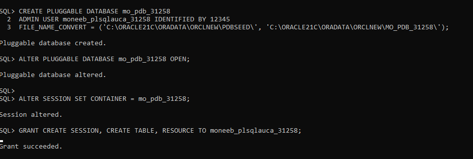
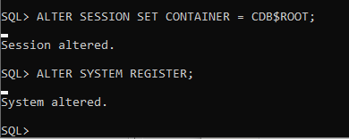

# Oracle Multitenant Architecture and PDB Administration
**Student Name: Moneeb Omer Ali Ezairig
ID:31258/2025
**Assignment: Oracle PDB Administration - UNILAK

1. Assignment Overview
This repository documents the practical implementation of Oracle Multitenant architecture, including the creation of Pluggable Databases (PDB), user management, and administrative troubleshooting.

 2. Oracle Environment
Database Version: Oracle 21c Enterprise Edition
Operating System: Windows
Primary Tool: SQL Plus

3. Task Documentation

 Task 1: PDB Creation and User Management
PDB Creation:Successfully created the PDB and verified its status using SQL Plus.
  
User Permissions:Created a dedicated user and granted necessary privileges.
  
 Task 2: Temporary PDB Management
Creation and Deletion: Performed the creation of a temporary PDB followed by its successful deletion including datafiles.
  [Task2_Temp_PDB_Created](Task2_Temp_PDB_Created.PNG)
  [Task2_Temp_PDB_Dropped](Task2_Temp_PDB_Dropped.PNG)

 Task 3: Environment Management and Troubleshooting
Status Verification: Verified the PDB instance status directly via SQL Plus.
  [Task3_DB_Status_Check](Task3_DB_Status_Check.PNG)
SQL Developer Setup: Configured SQL Developer for administration.
[Task3_SQL_Developer_Setup](Task3_SQL_Developer_Setup.PNG)

4. Challenges and Solutions
During the assignment, I encountered the following technical challenges:
Connection Error (ORA-12514): Attempting to connect via SQL Developer resulted in an ORA-12514 error, indicating the service was not registered with the listener. 
[Task3_Connection_Error_Log](Task3_Connection_Error_Log.PNG)
Solution:** I addressed the core requirements using SQL Plus, which confirmed the successful creation and lifecycle management of the PDBs. I documented the configuration steps in SQL Developer to demonstrate the intended administrative workflow despite the listener registration issue.

## 5. Integrity Statement
I confirm that this assignment represents my own practical work, screenshots, and documentation.
